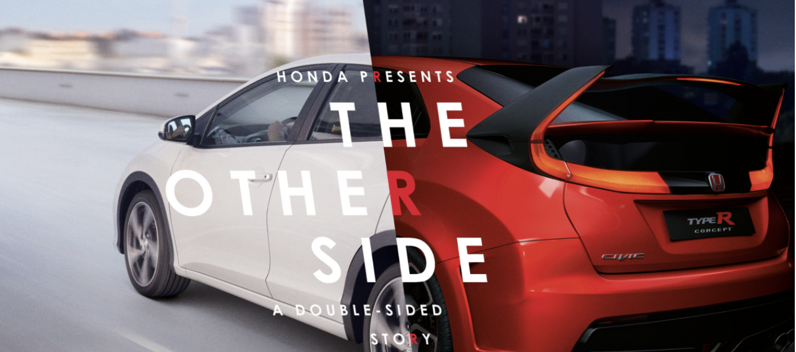
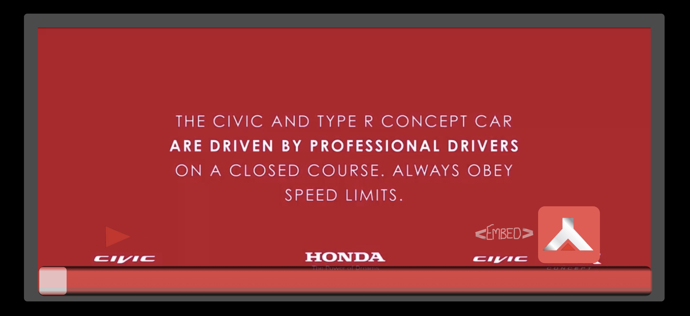

<h1> HondaR-Otherside </h1>

In this project, I will be looking at the custom video player used in the <a href="https://www.youtube.com/watch?v=dO5OTCxGCto"> 2015 Honda Civic R Video Campaign </a> and see how they achieved creating such a powerful marketing tool through providing a unique video playback experience. I will then try to recreate my own version of the video player using JS & HTML.

  

<h2> What they did ... </h2>
Honda designed a two-sided interactive film that enabled viewers to switch between stories about a suburban school-run and an art heist by typing “R” on their keyboards – a function that mirrors the Type R’s race button. Experience it <a href="http://wklondon.com/work/the-other-side/"> here </a> (works best in Safari).
The video gained an overall positive response, with 50% of people who saw it saying they were more inclined to buy a Civic R. However in my experience with the video I was slightly disappointed with how many bugs seemed to crop up when running the video in chrome.

<h2> My version </h2> 

<a href="http://honda-theotherside.surge.sh"> Hosted Here </a>

When creating this video player I had some key requirements that I wanted to keep in mind, such as;

> - The video player had to scale to the size of the browser
> - The user would only have to tap R on their keyboard / the switch button to show the other side (rather than hold it)
> - The two videos would have to stay perfectly in-sync to achieve the desired effect
> - The video player was to be built as a javascript class so that I may re-use it in future projects

These requirements each provided their own challenges, for example, the scaling required me to learn some basic CSS layout tricks and resize component dimensions in dynamic units of measurement. The "R" event/switch button required me to access the HTML video properties and manually mute it, as well as this my video player constructed itself with its own state and attributes so that it could keep track of what changes it was making to the video at certain moments. The constant tapping of these buttons is something inevitable in a project like this so I also utilized the event of them tapping the button to fire a function I built that re-syncs the videos back up by setting the current time of the first video equal to the second. Like I said I also wanted to build this as a javascript class and that is exactly what I did, a new video player instance is created when the window loads which constructs itself with 2 arguments (first video and second video), allowing this to be reused in future projects.

> 
 To experience "the other side" press the button in the lower right hand corner or tap 'r' on your keyboard, when you are in the other side the button will     display lit up as in the picture above. 

<h4> Usage </h4>

Interested in displaying this video player somewhere? Well don't worry, I included an embed button which will send an alert containing around 4 lines of code you can copy and use to display my video player via an iFrame in your project! 

